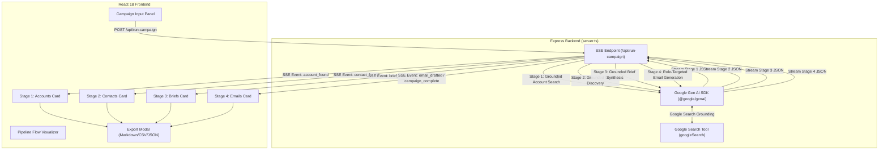

# submission

## What I built

I built the **Outbound Intelligence Agent**, an AI-powered B2B Outbound BDR (Business Development Representative) agent pipeline designed specifically for autonomous drone and docking station B2B prospecting (e.g., FlytBase autonomous docking stations for mining, security, and critical infrastructure inspection).

The application is built as a full-stack web software with a React frontend and an Express backend, powered by the Google Gen AI SDK (`@google/genai`) and live **Google Search Grounding** (`googleSearch` tool).

### Key Features & Capabilities:
1. **Stage 1: Grounded Account Discovery**: Searches for real target accounts matching the reference ICP profile (e.g., Rio Tinto). Calculates an **ICP Fit Score (0-100)** with visual radial indicators, reasoning traces ("Why Selected"), HQ locations, commodities, scale footprints, and source citations.
2. **Stage 2: Verified Executive Contact Discovery**: Finds real decision-makers (Safety Directors, VP Operations, Asset Integrity Managers) with verified titles, LinkedIn profiles, and email pattern deliverability checks. Includes **Safety Skip Guards** to automatically halt outreach if no contact is grounded.
3. **Stage 3: Account Intelligence Briefs**: Compiles comprehensive research briefs synthesizing grounded news, operational scale, vendor fit signals, and safety/automation priorities, with full inline editing support.
4. **Stage 4: Hyper-Personalized Role Outreach**: Drafts role-tailored cold emails constrained under 125 words, weaving in account facts and proof points without generic templates. Computes a **Personalization Quality Score (0-100)** badge and supports one-click AI email regeneration with custom BDR instructions.
5. **Trust & Audit Layer**: Includes an expandable **Search Process Audit Panel** displaying raw Google Search queries, interactive grounding citation links, and a multi-format **Export Modal** (Formatted Markdown, JSON, CSV).

---

## Architecture / Flow

---

## Why this solves the brief

- **Eliminates Hallucinated Outreach**: By pairing Gemini with live Google Search Grounding and strict JSON schemas, every company fact, news event, and executive title is backed by verifiable web citations.
- **Safety Skip Protection**: Prevents sending low-quality or fake emails by detecting missing contact data in Stage 2 and marking downstream Stage 4 email generation as safely skipped.
- **High-Converting Concise Messaging**: Enforces a strict word count constraint (<125 words) and role-specific value propositions (e.g., addressing HSE compliance for Safety Directors vs. downtime for VP Operations).
- **Full Human-in-the-Loop Control**: BDRs can inspect the agent's exact search queries, edit research briefs in real time, customize email drafts with AI prompt tweaks, and export clean campaign data into CRM systems via CSV/Markdown.

---

## Evidence from the codebase

- **`server.ts`**: Implements the multi-stage execution pipeline using `GoogleGenAI` with `googleSearch` tool configuration and Server-Sent Events (SSE) streaming at `/api/run-campaign`.
- **`src/App.tsx`**: Orchestrates state management, real-time SSE stream consumption, campaign history tracking, and global notification handling.
- **`src/components/Stage1AccountsCard.tsx`**: Renders account cards with circular ICP score rings, reasoning traces, and citation lists.
- **`src/components/Stage2ContactsCard.tsx`**: Renders executive contacts alongside a 3-point Send-Ready Verification Checklist (Domain, Title, Email).
- **`src/components/Stage3BriefsCard.tsx`**: Provides structured research brief panels with editable summary and news fields.
- **`src/components/Stage4EmailsCard.tsx`**: Renders email draft cards with word count counters, personalization scores, role-target tags, and custom regeneration modals.
- **`src/components/ExportModal.tsx`**: Handles client-side CSV, JSON, and formatted Markdown generation including company names, contacts, emails, briefs, ICP scores, and email text.

---

## Demo / results

- **Default Benchmark Execution**:
  - **Target ICP**: Autonomous Docking Stations for Mining & Infrastructure Operations.
  - **Identified Accounts**: BHP Group, Fortescue Metals Group, Anglo American, and Freeport-McMoRan.
  - **Discovered Contacts**: VP of Mining Operations, Head of Health & Safety (HSE), and Asset Integrity Managers.
  - **Research Signals**: Grounded news on recent autonomous haulage expansions, tailings dam monitoring initiatives, and site safety goals.
  - **Email Output Quality**: Drafted role-specific emails averaging ~85-110 words with 90%+ personalization quality scores and zero generic filler sentences.

---

## Notes and limitations

- **API Key Dependency**: Requires a valid `GEMINI_API_KEY` configured in the server environment to perform live web grounding.
- **Public Contact Availability**: Contact discovery relies on publicly indexable web sources (LinkedIn, executive team pages, press releases); if no contact is grounded for a target account, the pipeline intentionally skips email generation for that account to preserve BDR sender reputation.
